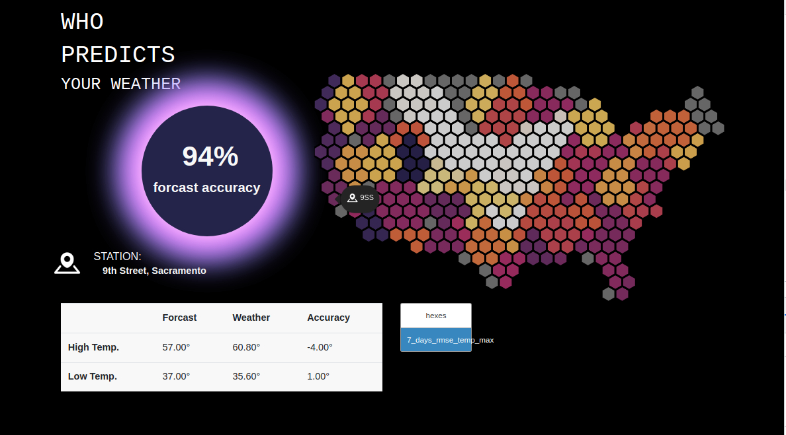

# Weather_app

I’ve used a friends api, collected from national weather services to create a hex map of the USA that can dynamically map data with the help of mapbox’s js library. Django is used as the container, written in python coding for the back-end and java script for the front. The app is mobile responsive and contains a few models that are used in it’s own a Rest-framework api. 

File analysis: 

From the top down starting in map, data and geodata are file containing static file that my json conversion scripts either save to or receives crucial starting data from. The json_convert_scripts file contains my two scripts, I originally started with, to convert a lon,lat json field into a geojson coordinates. The first converted to a point, the later, convertsquare, to a square. The linkedhex file is  a 80 line snip of code that got me started by Rhys Donoghue, from linked in, from this article: https://www.linkedin.com/pulse/how-create-hexagonal-choropleth-map-using-only-open-source-donoghue/ 

I communicated with Rhys and he gave me some pointers and I eventually, wrote converhex.py with his help as a framework. Converhex converts the fetched api data in a tessellated hexed geojson file that is in the boundery of the united states. This data , after being saved to a model, is then called Within our static server.js file.

Server.js, from the top, firstly calls mapbox with an access token and produces a blank template. We are not using any of mapbox’s pre-built map graphical interfaces, but we need the key to use mapbox-gl.js library. We then create multiple layers with data from our Rest-api. One url route contains the point, where we can access the data by clicking, the other contains the hex that visually displays the data in a heat-map via the stops on line 59. On line 183 we are defining a button toggle between different layer views. On line 236 two things happen, a popup occurs when the cursor is over a hex and once the hex is clicked data appears in box about the area. All of this data is dynamically loaded into various divs in our weathermap.html file and visually designed withing styles.css

Our admin.py is pretty basic, just calling the models. In apps I created a background scheduler to eventually automatically make a daily request for data at the beginning of a new day. Right now you can disable the scheduler via a # in weather_updater.py. Our models, are basically for storing two different geometries with the same features attributed to them in ForcastPoly and ForcastPoint. The jsons model is currently unused but may develop later. In steralizer.py we use rest_framework_gis for GeoModelSerializer to serialize our models int a geojson rest api.

Urls, has a slightly different organization with the rest-framework routes. And lastly, for the map folder, Views contains a few functions. Line 39 on down calls the api with get_weather_data, around line 72 we convert that data to tessellated hex geojson. On line 82 we are then saving our hexed geojson to our models, separating by the geometry type. Once the model is loaded PointViewset and WeatherViewset call for the serialization and posting of that data to the corresponding urls of the point an poly data needed for the map layers in the java script. 

In the weather folder a few changes were made to settings. Our database is now postgres, due to the need to save geometries, and large parsed geojson data. The databases section of settings in now configured for postgres. The pip package psycopg2 in requirements is the postgres package. I followed this tutorial in setting it up: https://www.youtube.com/watch?v=wmrygKdG1JE . The important thing is that the database be name: weather_db. The installed apps part of settings has a few rest framework apps added as well.

Conclusion:

The scope of this project can widen and widen. Obviously the next step is to daily load each days data and maybe animate the change in the data over time. Also I would like to maybe figure out how to nest the models so that the geometry and location can be stored separately from the feature data. This project was honestly the first time I realized I was capable of creating with and learning most tools for web and data design. I am very grateful for this push into comprehension by Harvard

note:

upon first installing your going to need to run with scheduler initialized via weather_updater.py. Then turn off, ie #,  once data loads.

On loading manage.py, when starting with scheduler initialized use:
python3 manage.py runserver --noreload

